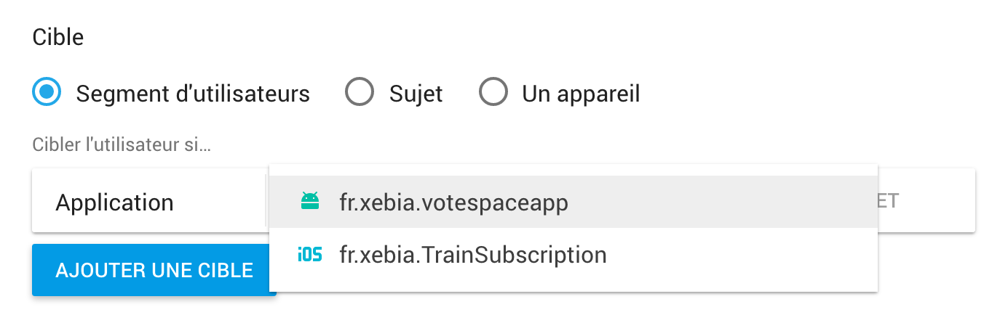
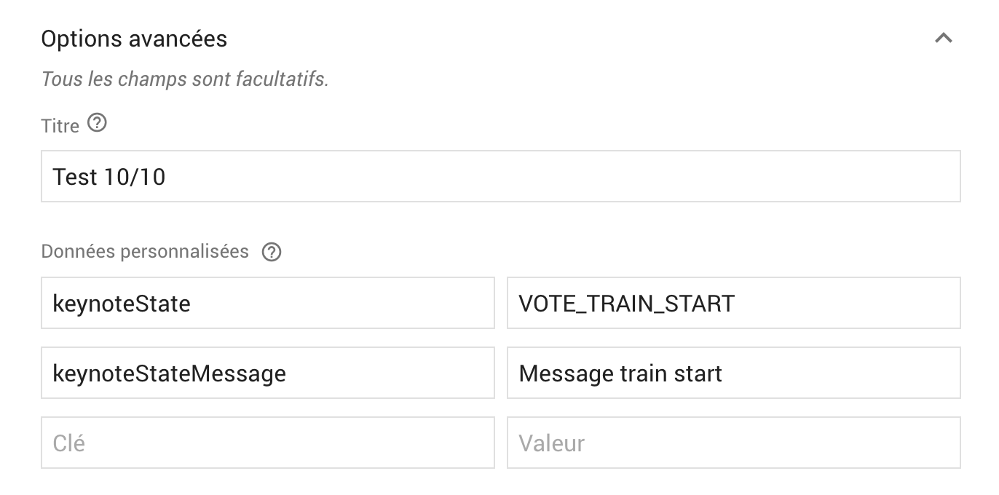

# Xebicon Android Vote

## Test with mobile vote server locally

- Launch mobile vote server
```
$ cd /path/to/xebicon/mobile-vote-server
$ docker run -d -p 3000:3000 -e "RABBIT_EXCHANGE=xebiconTest" xebiafrance/mobile-vote-server
```
- launch keynote scheduler 
```
$ cd /path/to/xebicon/keynote-scheduler
$ docker run -p 4000:4000 -e "RABBIT_EXCHANGE=xebiconTest" xebiafrance/xebicon-scheduler 
```
> Attention: make sure your mobile vote server & your scheduler connect to the
same rabbitMQ exchange
- Modify the `BASE_URL` in your `/app/build.gradle` file to your local mobile
vote server
- Launch your app & open the scheduler interface to trigger events

## Test directly with Firebase without scheduler

- Login to Firebase
- Launch your application & make sure it registered with success at the firebase
server (Logcat should indicate a `200` after the registration)
- Go to `Notification` on the left side menu bar
- Click on the create new push notification button
- Select your target



- Fill up advanced options:
	- `keynoteState`: `VOTE_TRAIN_START`
	- `keynoteStateMessage`: `Message trian start`



- Click on the `Send` button

If this works, your screen should go from Welcome screen to the vote screen